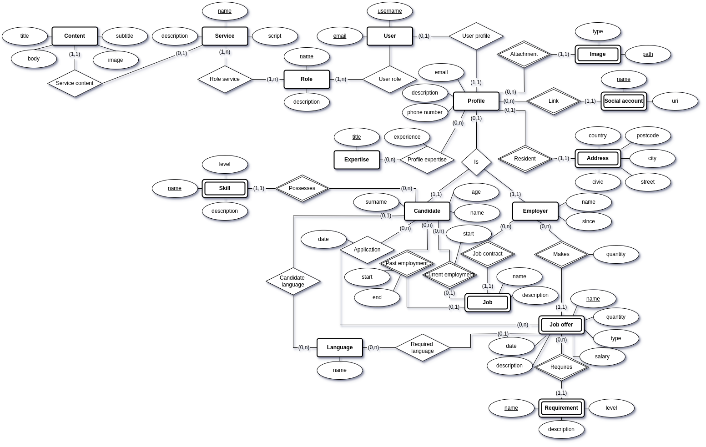

# Job Hunt

## Introduzione

**Job Hunt** è una piattaforma progettata per connettere creatori di contenuti con aziende in cerca di
talenti nel mondo del digital marketing, social media, video editing, copywriting, e altri campi creativi.

## Funzionalità

Job Hunt offre funzionalità dedicate per i diversi tipi di utenti della piattaforma: creatori di contenuti,
aziende, e amministratori. Di seguito una descrizione dettagliata delle principali funzionalità per ciascun gruppo.

### 1. Creatori di Contenuti

I creatori di contenuti possono accedere a diverse funzionalità che li aiutano a gestire il loro profilo professionale
e a trovare nuove opportunità lavorative:

- **Cerca Lavoro**: Accedi alle offerte di lavoro pubblicate da aziende in cerca di content creators.
- **Registrazione e Gestione Profilo**: Registrati sulla piattaforma inserendo i tuoi dettagli personali. Una volta
  registrato, potrai modificare il tuo profilo, includendo informazioni personali, foto profilo,
  esperienze lavorative precedenti e progetti personali pregressi.
- **Aggiungi Profili Social**: Collega i tuoi profili social per mostrare il tuo
  portfolio e aumentare la tua visibilità agli occhi delle aziende.
- **Gestione delle Candidature**: Candidati alle offerte di lavoro direttamente dalla piattaforma e gestisci lo stato
  delle tue candidature attraverso una sezione dedicata.

### 2. Aziende

Le aziende registrate su Job Hunt possono utilizzare la piattaforma per pubblicare offerte di lavoro e
cercare creatori di contenuti per le loro esigenze:

- **Pubblica Offerte di Lavoro**: Inserisci nuove opportunità lavorative specificando requisiti e dettagli dell'offerta.
- **Gestione del Profilo Aziendale**: Modifica il profilo aziendale. Aggiungi loghi, immagini e descrizioni che
  rappresentino al meglio la tua
  azienda.
- **Aggiungi Profili Social**: Collega i profili social della tua azienda per costruire
  una presenza più solida e interattiva sulla piattaforma.
- **Ricerca Creatori di Contenuti**: Ricerca creatori di contenuti in linea con le
  esigenze della tua azienda. Visualizza i loro profili dettagliati, che includono esperienze, progetti precedenti e
  link ai loro social.

### 3. Amministratori

Gli amministratori della piattaforma hanno accesso a strumenti per la gestione del sito:

- **Dashboard di Gestione**: Gli amministratori possono accedere a una dashboard che consente la gestione dei
  contenuti del sito web.
- **Modifica dei Contenuti del Sito**: Modifica testi, titoli, sottotitoli, e immagini presenti sulle pagine web della
  piattaforma per mantenere i contenuti aggiornati e rilevanti.
- **Aggiunta di lingue**: Scelta di quali lingue rendere disponibili per la pubblicazione di offerte di lavoro

## Progettazione logica

## Progettazione fisica

## In che modo l'applicazione soddisfa le specifiche del progetto?

### Dimensione del progetto

L'applicazione fa uso di un totale di 20 tabelle SQL, comprese quelle ottenute dalla normalizzazione delle relazioni

### Metodologia

#### Separazione della logica

La separazione della logica è realizzata usando il motore di templating _template2.inc.php_, come da specifiche

#### Gestione delle sessioni

L'applicazione utilizza una gestione delle sessioni di base per autenticazione e permessi dell'utenza

#### Gestione dell'utenza

Come è possibile notare dai diagrammi precedenti, l'applicazione è basata sul modello _users-groups-services_,
adeguatamente adattato alle specifiche esigenze implementative del database

#### Layout grafico

L'applicazione è basata sul template grafico omonimo disponibile su https://creativelayers.net/themes/jobhunt-html/

#### Dashboard dell'amministratore

L'applicazione fa uso del template grafico utilizzato a lezione (Star Admin) adattato al template grafico di JobHunt per
la gestione dei contenuti delle pagine web

## Nota

Il codice del progetto è disponibile su https://github.com/LTDW-2023-24/test-assignment-behind-the-code